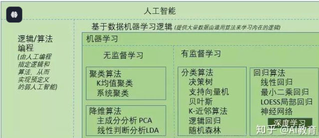
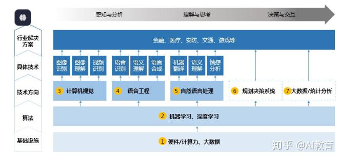

DL4J与Torch、Theano、TensorFlow、Caffe、Paddle、MxNet、Keras 和 CNTK的比较

人工智能研究的领域主要有五层：

1、最底层是基础设施建设，包含数据和计算能力两部分，数据越大，人工智能的能力越强。

2、往上一层为算法，如卷积神经网络、LSTM 序列学习、Q-Learning、深度学习等算法，都是机器学习的算法。

3、第三层为重要的技术方向和问题，如计算机视觉，语音工程，自然语言处理等。还有另外的一些类似决策系统，像 reinforcement learning（编辑注：增强学习），或像一些大数据分析的统计系统，这些都能在机器学习算法上产生。

4、第四层为具体的技术，如图像识别、语音识别、机器翻译等等。

5、最顶端为行业的解决方案，如人工智能在金融、医疗、互联网、交通和游戏等上的应用，这是我们所关心它能带来的价值。

卷积神经网络（Convolutional neural networks，简称CNNs）就是一种深度的监督学习下的机器学习模型，而深度置信网（Deep Belief Nets，简称DBNs）就是一种无监督学习下的机器学习模型。

